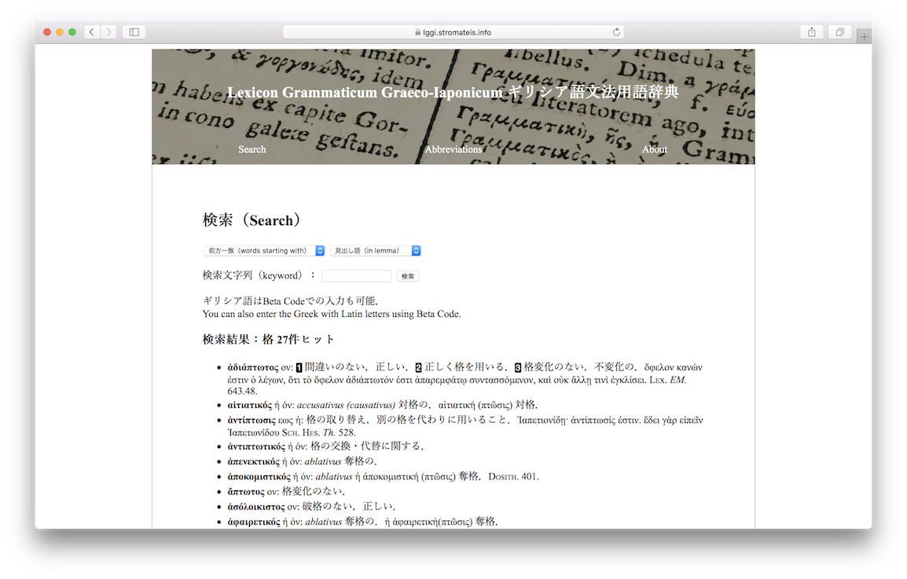

# Lexicon Grammaticum Graeco-Iaponicum

[Beta version](https://lggi.stromateis.info/search.php) is available.

## What is This?
**A Lexicon of Ancient Greek Grammatical/Philological Terms** (by PHP and MySQL). This lexicon has its origin in [A Wordlist of Greek Grammatical Terms](https://www.stromateis.info/zib/gramm_term.html).

Based on mainly Dickey's glossary (cf. Dickey 2007: 217-265), it aims to cover all the grammatical/philological terms.

## Usage
- Import `wordList.csv` into your SQL Server (make some modifications, if necessary).
- Open `search.php` and enter keyword.

## How to Contribute
Comments and corrections are welcome! Please leave a comment or create an issue, if you have any suggestion.

## Selected Bibliography

- Bécares Botas, V. (1985), *Diccionario de terminología gramatical griega*, Salamanca: Ediciones Universidad de Salamanca.
- Dickey, E. (2007), *Ancient Greek Scholarship*, Oxford University Press.
- *DGE* = [*Diccionario Griego-Español*](http://dge.cchs.csic.es).
- *LSJ* = *A Greek-English Lexicon,* compiled by Liddell, H.G., and Scott, R., revised and augmented throughout by Jones, H.S., Oxford: Clarendon Press, (9th ed. 1940, new supplement added 1996).
- Montanari, F. (2013, 3a ed.), *Vocabolario della lingua greca*, Torino: Loescher.
- Schad, S. (2007), *A Lexicon of Latin Grammatical Terminology,* Pisa/Roma: Fabrizio Serra.
- Sophocles, A.E. (1914), *Greek Lexicon of the Roman and Byzantine Periods (from B.C. 146 to A.D. 1100),* Harvard University Press.

## Contact
[Website](https://www.stromateis.info) [Github](https://github.com/ncrt035) [Mastodon](https://gnosia.info/@ncrt035) [Twitter](https://twitter.com/ncrt035)

### License
MIT License: Copyright &copy; Tetsufumi Takeshita
